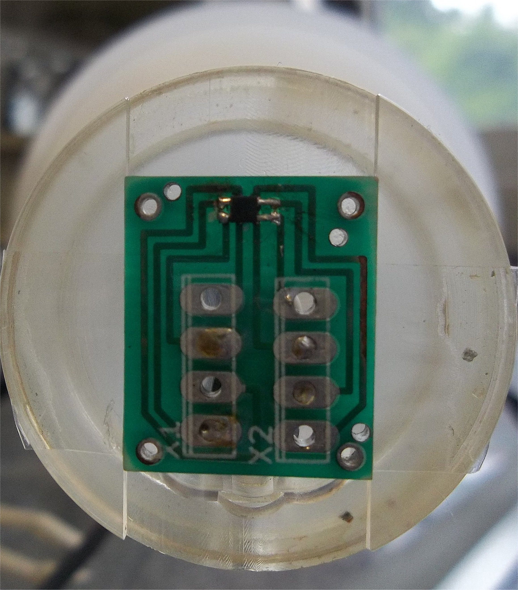

# Data sets used in the paper

The magnetic induction data on the four observation planes around our synthetic sample were measured by a
scanning Hall magnetic microscope, developed at Pontifical Catholic University of Rio de Janeiro (PUC-Rio), in Brazil.
It is based on a commercial GaAs Hall-effect sensor (HG-176A, AKM Inc. shown at the Figure below) that detects the remanent magnetic field
normal to the scanning plane. The sensor has an active area size of 300 μm, which is 250 μm distant from the top of the
encapsulation. The maximum spatial resolution achieved is about the size of the sensors active area. The magnetic field
sensitivity measured is 350 nT /Hz 1/2 in the white noise region. The sensor is current biased and pre-amplified by a
custom-made electronics at 1.0 kHz, and the output Hall voltage is detected by a lock-in amplifier. In our microscope,
two independent linear micropositioners (T-LLS260, Zaber Technologies) were oriented perpendicularly and stacked,
making up an x − y stage with a maximum travel range of 50 mm in each direction. An acrylic pedestal, 15 mm
long, is fixed to the stage, serving two purposes, providing a flat surface for the sample to be mounted to and increasing
the distance from the sample to the micropositioners motors minimizing inductive effects. The sensor is mounted
on another acrylic rod that can be raised or lowered using a linear actuator (T-LA60A, Zaber Technologies), allowing
for the adjustment of the sensor to sample distance with micrometer accuracy. The scanning of the sample is made
in a stop-and-go system, meaning that when the sample is moved to a scanning position, it stops for the magnetic field
measurement and only then, it goes to the next position. In order to reduce environmental magnetic noise present at
the laboratory, the experimental measurements were made inside a small 3 layer open-end magnetic shielded chamber
(TLM S-0100, Bartington Instruments). We used for scanning a step of 200 μm in both x and y directions. On each
plane α = 0, 1, 2, 3, the magnetic data were measured at a constant distance h ≈ 500 μm, on a regular grid of 102 × 42
points along the x and y/z axes.

*This picture shows the GaAs Hall-effect sensor used to measure all the data used in this paper with the magnetic microscope at PUC-Rio. The sensor has an effective area size of 300 μm, which is 250 μm distant from the top of the encapsulation.*

The data used in inversion, after correcting some misalignments cited in the paper:

* `data0.txt`: This is data file in text format of the plane α = 0.

* `data1.txt`: This is data file in text format of the plane α = 1.

* `data2.txt`: This is data file in text format of the plane α = 2.

* `data3.txt`: This is data file in text format of the plane α = 3.
